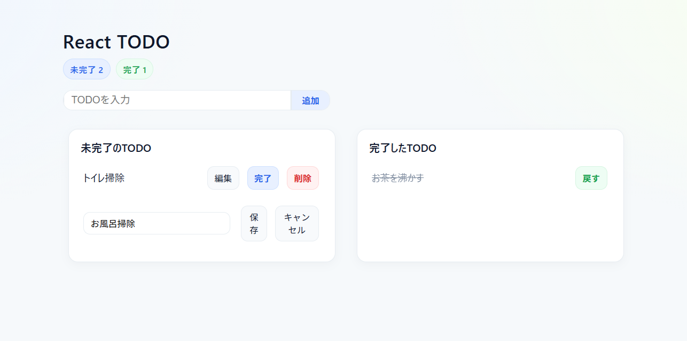

# React TODO

未経験からの学習ポートフォリオとして作成したシンプルな TODO アプリです。  
未完了／完了の切り替え、編集、削除、localStorage 永続化に対応しています。

## デモ

- 本番 URL：<<Vercel の URL>>
- リポジトリ：https://github.com/hoge-mura/todo-react

## スクリーンショット

## 主な機能

- タスクの追加（Enter キー対応・空白ガード）
- タスクの編集（保存／キャンセル）
- 未完了 ↔ 完了（戻す）の切り替え
- 削除
- ブラウザ `localStorage` による保存・復元
- スマホ幅で 1 カラムに自動レイアウト

## 技術スタック

- React (Hooks)
- Vite / Node.js
- JavaScript (ES6)
- CSS（軽量スタイル）

## ディレクトリ構成（抜粋）

src/
├─ components/
│ ├─ CompleteTodos.jsx
│ ├─ IncompleteTodos.jsx
│ └─ InputTodo.jsx
├─ Todo.jsx
├─ index.jsx
└─ styles.css
